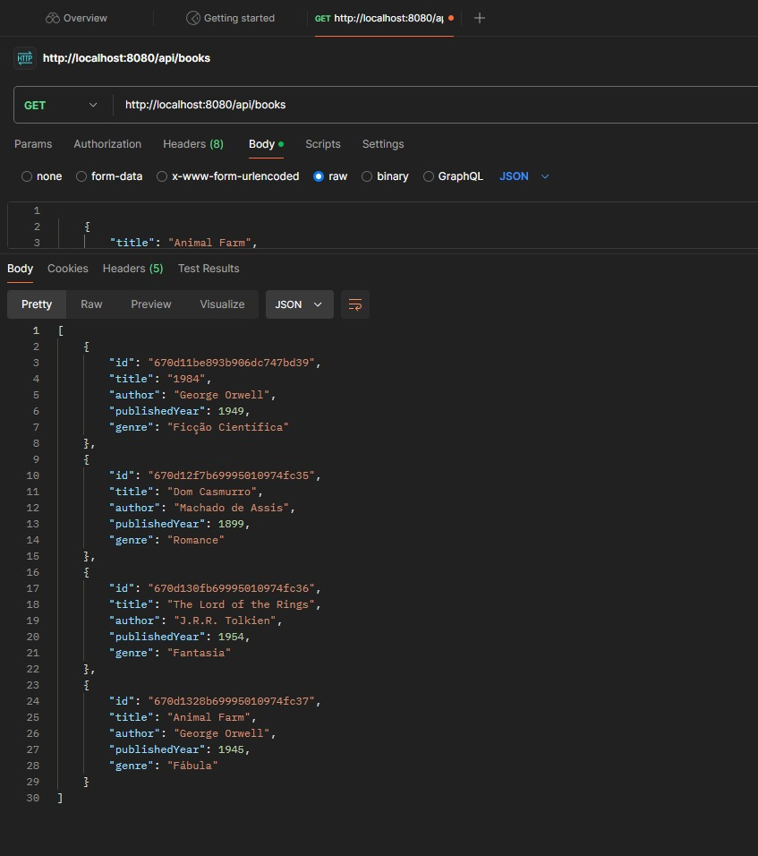
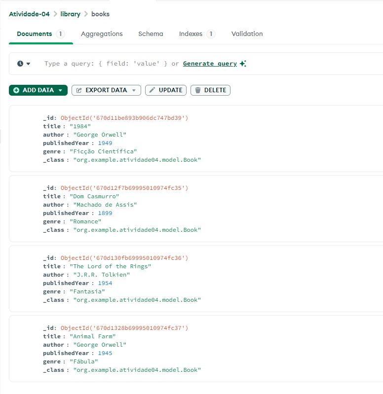

# 📚 Sistema de Biblioteca com MongoDB

## 📝 Descrição

Este projeto é um Sistema de Biblioteca desenvolvido com Spring Boot e MongoDB. Ele permite gerenciar um conjunto de livros, oferecendo operações de CRUD (Create, Read, Update, Delete) sobre os registros.

## 📑 Índice

- [Funcionalidades](#funcionalidades)
- [Pré-requisitos](#pré-requisitos)
- [Como Configurar o MongoDB](#como-configurar-o-mongodb)
- [Como Executar o Projeto](#como-executar-o-projeto)
- [Demonstração](#demonstração)
- [Estrutura de Pastas](#estrutura-de-pastas)

## 🚀 Funcionalidades

- **Adicionar Livros:** Cadastro de novos livros no sistema, com título, autor, ano de publicação e gênero.
- **Atualizar Livros:** Permite atualizar informações de um livro existente.
- **Buscar Livros:** Busca de livros por autor ou por ano de publicação.
- **Deletar Livros:** Remoção de livros da coleção.

## 🧰 Pré-requisitos

Certifique-se de ter as seguintes ferramentas instaladas:

- [Java JDK 11+](https://www.oracle.com/java/technologies/javase-jdk11-downloads.html)
- [MongoDB](https://www.mongodb.com/try/download/community): Banco de dados MongoDB instalado e configurado.
- [Maven](https://maven.apache.org/install.html): Para compilar e gerenciar as dependências do projeto.

## 🛠 Como Configurar o MongoDB

1. Inicie o MongoDB localmente e crie um banco de dados chamado `library`.
2. No arquivo `application.properties`, configure a URL de conexão com MongoDB:

    ```properties
    spring.data.mongodb.uri=mongodb://localhost:27017/library
    ```

## 🚀 Como Executar o Projeto

1. **Clone o repositório:**


2. **Execute o projeto com Maven:**

    ```bash
    mvn spring-boot:run
    ```

3. O serviço estará disponível em `http://localhost:8080`.

## 🎬 Demonstração

Exemplo de inserção de um livro via Postman:



```
POST /api/books
{
    "title": "1984",
    "author": "George Orwell",
    "publishedYear": 1949,
    "genre": "Ficção Científica"
}
```

Exemplo no MongoDB:



## 📂 Estrutura de Pastas
- **model:**  Contém a classe Book que representa o modelo de dados.
- **repository:** Interface BookRepository para interagir com o MongoDB.
- **service:** Classe BookService que encapsula a lógica de negócios.
- **controller:** Controlador BookController que gerencia as requisições HTTP.
- **comandosMongoDB.txt:** Arquivo Script com os comandos MongoDB Query Language